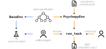

.. image:: https://zenodo.org/badge/DOI/10.5281/zenodo.10942784.svg
  :target: https://doi.org/10.5281/zenodo.10942784
.. image:: https://codecov.io/gh/rewardMap/rewardGym/graph/badge.svg?token=NVVNHNP38M
  :target: https://codecov.io/gh/rewardMap/rewardGym
.. image:: https://github.com/rewardMap/rewardGym/actions/workflows/build-sphinx.yaml/badge.svg
.. image:: https://github.com/rewardMap/rewardGym/actions/workflows/pip-push.yaml/badge.svg

==================================
rewardGym
==================================

Ambitiously called ``rewardGym``, this is a part of the ``rewardMap`` project.

The project's goal is to provide two things:

1. A common language for reward tasks used in research.
2. A common interface to display and collect data for these tasks.

Under the hood this module uses the `gymnasium <https://github.com/Farama-Foundation/Gymnasium>`_ [cit1]_. The general package has
been greatly inspired by `neuro-nav <https://github.com/awjuliani/neuro-nav>`_ [cit2]_, especially the use of a graph structure to represent the tasks.

Many thanks also to `physiopy <https://github.com/physiopy>`_, from where I took many of the workflows and
automatization around the repository (such as workflows and PR labels)!

Installation
-------------------------------------------------------------------------------

I recommend creating a new python environment (using e.g. ``venv`` or ``conda``).

Then install the package and all necessary dependencies using::

    pip install git+https://github.com/rewardMap/rewardGym

Alternatively, download / clone the repository and install from there::

    git clone https://github.com/rewardMap/rewardGym
    cd rewardGym
    pip install -e .

Usage
-------------------------------------------------------------------------------

The package should be importable as usually. See the `documentation <https://rewardmap.github.io/rewardGym/>`_ for further information.

Use PsychoPy for data collection
********************************************************************************

There might be cases, where you want to use this package purely for data collection.

The current release, basic logging is supported.

This is also possible using `PsychoPy <https://psychopy.org/>`_ Standalone [cit3]_ (only tested version v2023.2.3, early v2024 versions were incompatible due to the GUI structure).

For this clone or download the repository.

E.g.::

    git clone https://github.com/rewardMap/rewardGym

**IMPORTANT:**

Afterwards, you can use the PsychoPy coder to run ``rewardgym_psychopy.py``, which is located in the root directory.

Outputs of this program will be saved by default in the ``data`` directory.

Run the environment and train an agent
********************************************************************************

Running a task could look like the following

.. code-block:: python

    from rewardgym import get_env
    from rewardgym.agents.base_agent import QAgent

    env = get_env('hcp')
    agent = QAgent(learning_rate=0.1, temperature=0.2,
                   action_space=env.n_actions, state_space=env.n_states)

    n_episodes = 1000

    for t in range(n_episodes):

        obs, info = env.reset()

        done = False

        while not done:

            action = agent.get_action(obs)

            next_obs, reward, terminated, truncated, info = env.step(action)

            agent.update(obs, action, reward, terminated, next_obs)
            done = terminated or truncated
            obs = next_obs

Contributing
********************************************************************************

First off, thanks for taking the time to contribute! ❤️

All types of contributions are encouraged and valued! Unfortunately, there is
no detailed contribution guide - but it is planned!

If you have a question and do not find any answers in the `Documentation <https://rewardmap.github.io/rewardGym/>`_
or the documentation is unclear, please do not hesitate to open an `Issue <https://github.com/rewardMap/rewardGym/issues/new>`_.

The same goes for any kind of bug report.

Before you make an enhancement, please open an issue first, where we will discuss if this is in the scope of the toolbox.

Finally, if you want to add a new task, also open an issue, and we will help you with implementing it in the toolbox.

Play a task (currently out of order)
********************************************************************************

To play one of the tasks using a simplified pygame implementation, you can e.g.
run::

    rg_play hcp --window 700 --n 5

To play the gambling task from the human connectome project, in a window of 700 x 700 pixels for 5 trials.

The available tasks are:

hcp
    Gambling task from the human connectome project. Response buttons are: left + right.
mid
    Monetary incentive delay task. Response button is: space
two-step
    The classic two-step task. Response buttons are: left + right
risk-sensitive
    Risk sensitive decision making task, contains both decision tasks between to outcome and singular event. Response buttons are: Left + right
posner
    Posner task. Response buttons are left + right.
gonogo
    Go / No-Go task, different stimuli indicate go to win, go to punish etc. Response button is: space.

Git submodules are added like this:

git submodule add https://github.com/rewardMap/robotfactory.git rewardgym/tasks

References
--------------------------------------------------------------------------------
.. [cit1] Towers, M., Terry, J. K., Kwiatkowski, A., Balis, J. U., Cola, G. de, Deleu, T., Goulão, M., Kallinteris, A., KG, A., Krimmel, M., Perez-Vicente, R., Pierré, A., Schulhoff, S., Tai, J. J., Shen, A. T. J., & Younis, O. G. (2023). Gymnasium. Zenodo. https://doi.org/10.5281/zenodo.8127026
.. [cit2] Juliani, A., Barnett, S., Davis, B., Sereno, M., & Momennejad, I. (2022). Neuro-Nav: A Library for Neurally-Plausible Reinforcement Learning (arXiv:2206.03312). arXiv. https://doi.org/10.48550/arXiv.2206.03312
.. [cit3] Peirce, J., Gray, J. R., Simpson, S., MacAskill, M., Höchenberger, R., Sogo, H., Kastman, E., & Lindeløv, J. K. (2019). PsychoPy2: Experiments in behavior made easy. Behavior Research Methods, 51(1), 195–203. https://doi.org/10.3758/s13428-018-01193-y
